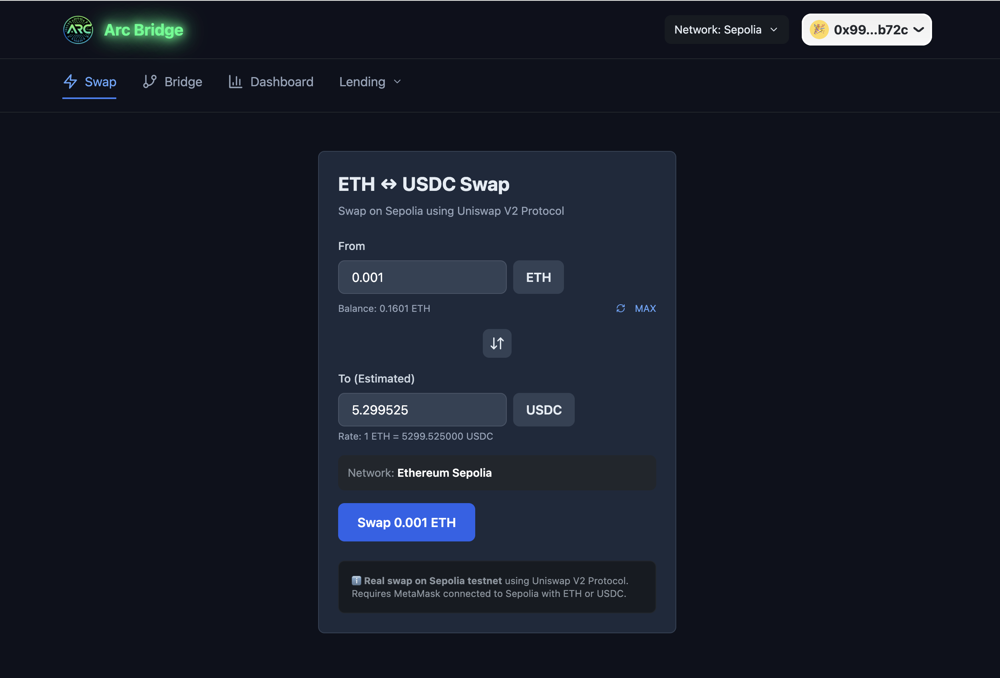
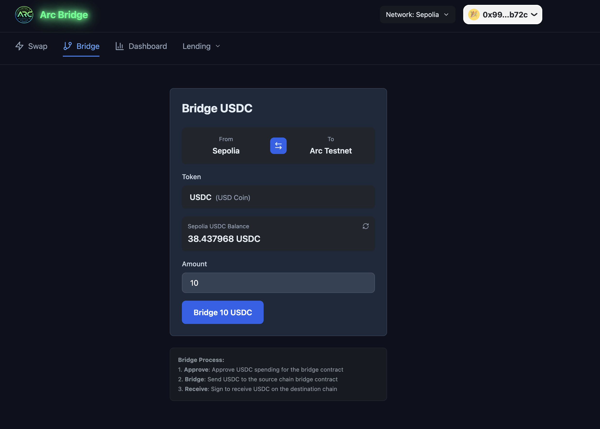
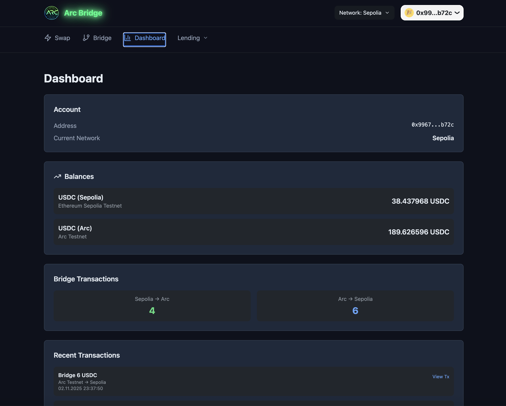

# Arc Sepolia DEX Bridge

A **production-ready** decentralized exchange and cross-chain bridge application featuring **real on-chain transactions**. Swap Sepolia ETH to USDC using Uniswap V2, then bridge USDC to Arc Testnet using Circle Bridge Kit.

## ✨ Key Features

### 🔄 Real Uniswap V2 Swap (Sepolia)
- **Live ETH ↔ USDC swapping** on Sepolia testnet
- Real-time price estimation using Uniswap V2 Router
- Actual on-chain transactions (not mock)
- ERC20 token approval + swap execution
- Etherscan transaction links
- Bidirectional: ETH → USDC or USDC → ETH
- **Rate limiting**: 0.1 ETH max per wallet per 24 hours (ETH → USDC only)
- Full error handling and user feedback

### 🌉 Real Circle Bridge Kit (Bidirectional)
- **Live bidirectional USDC bridging**: Sepolia ↔ Arc Testnet
- @circle-fin/bridge-kit official integration
- Automatic chain switching
- Real transaction hashes for source and destination
- Dual Etherscan + ArcScan links
- Proper bridge state progression
- Comprehensive error handling

### 📊 Dashboard Tab
- **Wallet Information** - Connected address and network
- **USDC Balances** - Real balances on Sepolia and Arc Testnet

## � Screenshots

### Swap Interface


### Bridge Interface


### Dashboard


## �🚀 Quick Start

### Prerequisites
- Node.js 18+
- npm or yarn
- **MetaMask wallet**
- **Sepolia testnet ETH** (from [Sepolia faucet](https://www.sepoliafaucet.io))
- **Sepolia testnet USDC** (from [Circle faucet](https://faucet.circle.com))
- **Arc Testnet added to MetaMask** (manual setup required)

### Manual Arc Testnet Setup
Add Arc Testnet to MetaMask:
- **Network Name**: Arc Testnet
- **RPC URL**: `https://rpc.testnet.arc.network`
- **Chain ID**: `5042002`
- **Currency Symbol**: `USDC`
- **Block Explorer**: `https://testnet.arcscan.app`

### Installation

```bash
# Clone and install
git clone https://github.com/dharmanan/Arc-Testnet-Bridge-Swap.git
cd Arc-Testnet-Bridge-Swap
npm install

# Start development server (port 3000)
npm run dev
```

Visit `http://localhost:3000` in your browser with MetaMask connected to Sepolia.

### Build for Production

```bash
npm run build
```

## 🌐 Supported Networks

| Network | Chain ID | RPC | Explorer |
|---------|----------|-----|----------|
| Ethereum Sepolia | 11155111 | https://rpc.sepolia.org | https://sepolia.etherscan.io |
| Arc Testnet | 5042002 | https://rpc.testnet.arc.network | https://testnet.arcscan.app |

## 📋 Token Addresses

### Sepolia
| Token | Address |
|-------|---------|
| WETH | `0x7b79995e5f793A07Bc00c21412e50Ecae098E7f9` |
| USDC (Bridge Kit) | `0x1c7D4B196Cb0C7B01d743Fbc6116a902379C7238` |

### Arc Testnet
| Token | Address |
|-------|---------|
| USDC (Native) | `0x3600000000000000000000000000000000000000` |

## 🛠️ Tech Stack

- **Frontend**: React 18, TypeScript 5.2, Vite 4.5.14
- **Styling**: Tailwind CSS 3.3
- **Icons**: Lucide React
- **Wallet**: wagmi 2.5.0, @rainbow-me/rainbowkit 2.1.0
- **Web3**: ethers.js v6.7.1, viem 2.0.0
- **DEX**: Uniswap V2 SDK
- **Bridge**: @circle-fin/bridge-kit, @circle-fin/adapter-viem-v2
- **Animations**: framer-motion, canvas-confetti

## 📂 Project Structure

```
src/
├── components/
│   ├── SwapTab.tsx       # Uniswap V2 swap interface
│   ├── BridgeTab.tsx     # Circle Bridge Kit interface  
│   ├── DashboardTab.tsx  # Account & balances dashboard
│   └── ui/               # UI components
├── hooks/
│   ├── useSwap.ts        # Uniswap V2 swap logic
│   └── useBridgeKit.ts   # Circle Bridge Kit logic
├── App.tsx
└── main.tsx
```

## 🔄 Complete Workflow

```
1. Connect MetaMask Wallet (Sepolia)
   ↓
2. Go to Swap Tab
   - Select ETH → USDC direction
   - Enter amount
   - Approve + sign swap
   ✅ Get real USDC on Sepolia (Etherscan link provided)
   ↓
3. Go to Bridge Tab
   - Select Sepolia → Arc direction
   - Enter USDC amount
   - Approve + sign bridge
   ✅ Get native USDC on Arc Testnet (ArcScan link provided)
   ↓
4. View on Dashboard
   - See balances on both chains
   - Access transaction links
```

## 🔗 Important Smart Contract Addresses

| Contract | Address | Network |
|----------|---------|---------|
| Uniswap V2 Router | `0xC532a74256D3Db42D0Bf7a0400fEFDbad7694008` | Sepolia |
| USDC (Bridge Kit) | `0x1c7D4B196Cb0C7B01d743Fbc6116a902379C7238` | Sepolia |
| USDC (Native) | `0x3600000000000000000000000000000000000000` | Arc |

## 🔐 Security Notes

- ✅ All transactions signed by user wallet
- ✅ Testnet-only (no real funds)
- ✅ Standard ERC-20 and Uniswap V2 contracts
- ✅ Circle Bridge Kit production-grade
- ⚠️ Always verify addresses before approving

## 📖 Available Scripts

```bash
npm run dev      # Start dev server (port 3000)
npm run build    # Build for production
npm run preview  # Preview production build
npm run lint     # Run ESLint
```

## 🐛 Troubleshooting

**Wallet Connection**
- Ensure MetaMask connected to Sepolia testnet
- Add Arc Testnet manually if not available

**Bridge Not Working**
- Ensure sufficient USDC balance on Sepolia
- Check both chains are configured in MetaMask
- Verify Bridge Kit supported

**Swap Fails**
- Check you have enough ETH for gas
- Verify sufficient token balance
- Check Uniswap liquidity

## 📝 Additional Resources

- [See all features](./FEATURES.md)
- [Setup & deployment guide](./SETUP.md)
- [Development documentation](./DEVELOP.md)
- [Uniswap V2 Docs](https://docs.uniswap.org/contracts/v2/)
- [Circle Bridge Kit Docs](https://developers.circle.com/bridge-kit)
- [ethers.js v6](https://docs.ethers.org/v6/)
- [wagmi Documentation](https://wagmi.sh/)

## 📄 License

MIT

---

**Last Updated**: November 2025
**Status**: Production Ready ✅
**Networks**: Sepolia + Arc Testnet
